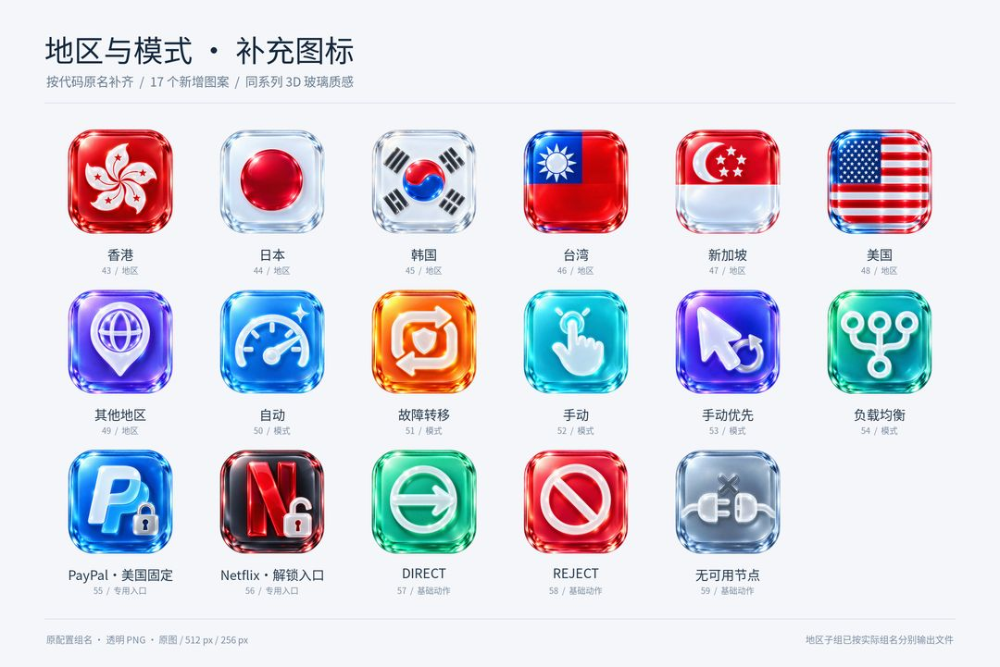

# iOS 风格 3D 玻璃分流图标

## 发布进度

- **256px：84 / 84 个命名文件，完整可用。**
- **512px：84 / 84 个命名文件，完整可用。**
- 原图：59 个独立图案已生成，正在上传；以 originals 目录实际内容为准。
- **预览：全部图标总览、地区与模式预览均已发布。**

59 个独立图案覆盖原代码的全部 81 个策略分组，另含 DIRECT、REJECT、无可用节点。没有修改或接入分流配置。

[下载已发布文件](https://github.com/ixxooxo-alt/icon/archive/refs/heads/main.zip) · [256px 图标](256px/) · [512px 图标](512px/) · [原图](originals/)

## 全部图标总览


## 地区与模式预览



## 图片直链

[图片地址 CSV](icon-urls.csv) · [图片地址 JSON](icon-urls.json) · [分组映射](group-icon-map.json)

256px 和 512px 地址全部可用。原图地址尚未全部发布，使用前请按 originals 目录确认。

```text
https://raw.githubusercontent.com/ixxooxo-alt/icon/main/512px/OpenAI.png
```

逻辑名称 `Apple Music/TV` 的文件名采用全角斜杠 `Apple Music／TV.png`。Policy 是配置段名，fallback 是组类型，文件以原代码中的实际组名命名。

图案由 AI 生成，品牌标识权利归各自权利人所有。
