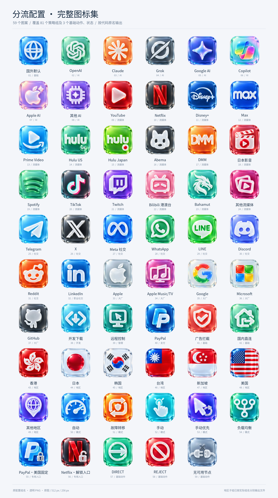

# iOS 风格 3D 玻璃分流图标

为分流配置制作的透明背景 PNG 图标。所有策略名称以原配置代码为准。此仓库只发布图标，没有修改或接入分流配置。

共 **59 个独立图案**，覆盖 **81 个策略分组**，另含 `DIRECT`、`REJECT`、`无可用节点`；256px 与 512px 目录各有 **84 个按名称导出的 PNG 文件**。

## 整体预览



[地区与模式图标预览](previews/regions-and-modes-preview.png)

## 下载

- [256px 全部图标下载](https://raw.githubusercontent.com/ixxooxo-alt/icon/main/downloads/routing-icons-256px.zip)
- [512px 图标下载：第 1 包](https://raw.githubusercontent.com/ixxooxo-alt/icon/main/downloads/routing-icons-512px-part-1.zip)
- [512px 图标下载：第 2 包](https://raw.githubusercontent.com/ixxooxo-alt/icon/main/downloads/routing-icons-512px-part-2.zip)
- [完整仓库 ZIP：含原图、两种尺寸、预览和清单](https://github.com/ixxooxo-alt/icon/archive/refs/heads/main.zip)

512px 两个包各含 42 个文件，解压到同一目录即可合并为完整 84 个文件。原图在 `originals/`，也可以逐张下载。

## 图片直链

配置界面引用 PNG 时，使用 `raw.githubusercontent.com` 图片地址。GitHub 的 `/blob/` 地址是网页，不能作为图片直链。

[全部图标地址 CSV](icon-urls.csv) · [全部图标地址 JSON](icon-urls.json) · [分组与图标映射](group-icon-map.json)

示例：

```text
https://raw.githubusercontent.com/ixxooxo-alt/icon/main/256px/OpenAI.png
https://raw.githubusercontent.com/ixxooxo-alt/icon/main/512px/Netflix.png
```

中文、空格与特殊符号的编码地址已在清单中提供，无需手工拼接。

`main` 链接会跟随后续更新。如需锁定当前图标，把地址中的 `main` 替换为本次提交 SHA。

## 分组命名

- 地区：香港、日本、韩国、台湾、新加坡、美国、其他地区。
- 六个常规地区分别导出自动、故障转移、手动、手动优先、负载均衡子组，共 30 个命名文件；同一模式在各地区复用图案。
- 特殊组：`PayPal·美国固定`、`Netflix·解锁入口`。
- `Policy` 是 Quantumult X 的配置段 `[policy]`，不是独立分组；`fallback` 是组类型。以代码中的实际名称导出，没有虚构同名策略。
- 逻辑名称 `Apple Music/TV` 在文件名中使用全角斜杠：`Apple Music／TV.png`；映射中的逻辑名称保留原样。

## 目录

| 目录或文件 | 用途 |
| --- | --- |
| `originals/` | 59 个独立图案的原始透明 PNG |
| `512px/` | 84 个按分组和基础动作名称导出的 PNG |
| `256px/` | 同上，适合较小图标展示 |
| `previews/` | 全部图标及地区/模式补充预览 |
| `downloads/` | 便于分次下载的 ZIP 包 |
| `icon-urls.csv` / `icon-urls.json` | 可直接引用的图片地址 |
| `group-icon-map.csv` / `group-icon-map.json` | 原配置名称与文件的对应关系 |
| `artwork-index.json` / `coverage-validation.json` | 原图信息与名称覆盖检查 |

## 文件说明

图案由 AI 生成，尺寸版本由原图缩放导出。所有 PNG 保留透明背景。地区旗帜元素为图标化表达。

品牌图案用于标识对应服务，相关标识权利归各自权利人所有，本仓库不表示与其有合作或官方关系。
